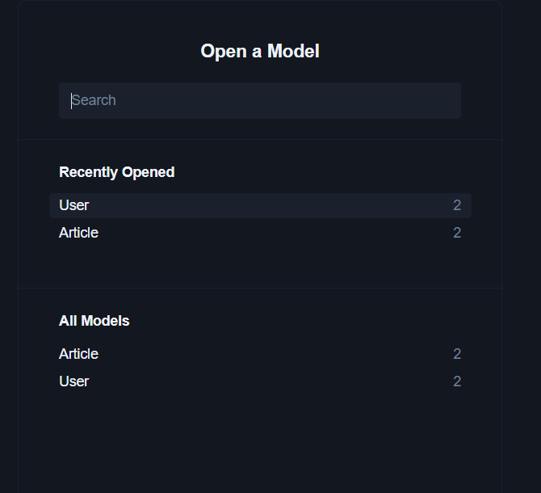
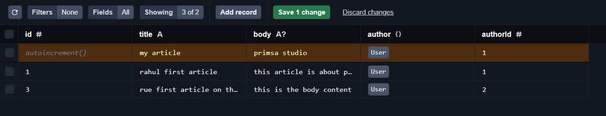

# Prisma-with-nodeJS-basic

Prisma is an open-source ORM (Object-Relational Mapping) tool that simplifies database access for applications written in JavaScript and TypeScript. It provides a powerful and type-safe API to interact with databases, enabling developers to perform CRUD (Create, Read, Update, Delete) operations more efficiently and with fewer errors.

